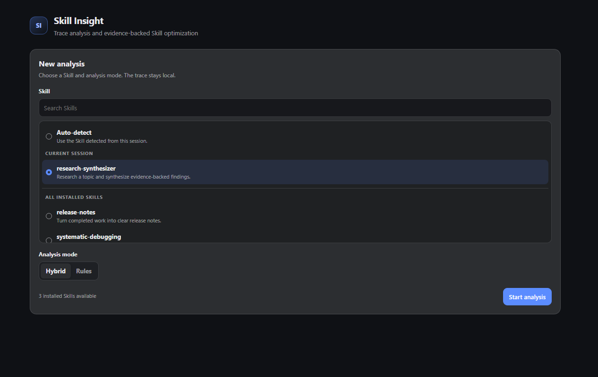

# DeepSeek Harness Skill Insight

A local-first, command-triggered plugin for [DeepSeek Harness](https://github.com/deepseek-ai/deepseek-harness). It freezes the current Session trace, finds evidence-backed problems, and can propose a guarded update to the Skill that guided the run.

This is a native Harness bundle, not a VS Code extension. The Web UI appears as a **Skill Insight** tab inside DeepSeek Harness. A future editor adapter can consume the same versioned `report.json` artifacts without changing the analyzer.

[简体中文](README.zh-CN.md)



## What it does

- Runs only when you explicitly enter `/skill-insight …`; no background analysis.
- Reads the immutable Session event log up to a frozen sequence cutoff.
- Redacts secrets, email addresses, and home-directory identities before analysis.
- Detects repeated tool calls, tool failures, missing recovery, late Skill loading, and a mismatched Skill selection with deterministic rules.
- Optionally asks the Session's selected provider/model for a structured second opinion and revised Skill body.
- Shows metrics, findings, trace evidence, validation results, and a unified diff in the Harness Web UI.
- Applies and reverts only file-backed `SKILL.md` proposals whose SHA-256 baseline still matches.
- Preserves YAML frontmatter and original newline style.
- Stores a stable JSON report and local snapshots under `$DSH_HOME/skill-insight/`.
- Explicitly clears one analysis or all active analyses in the current Session, with UI confirmation and path-safe local deletion.
- Persists UI state through Harness's official `command/run` and `command/done` lifecycle, so resumed Sessions remain loadable.

## Requirements

- DeepSeek Harness `0.1.0-rc.6`.
- Node.js 22 or later.
- A Web profile for the visual tab.
- A selected provider/model only when using the default hybrid mode. Rules mode needs no auxiliary model call.

Harness is still in preview, so its plugin API may change. This package pins the preview APIs it was verified against.

## Install

### From a local checkout

```sh
npm ci
npm run package
dsh plugin --profile web add ./deepseek-harness-skill-insight-0.1.1.tgz
dsh --profile web --dump-config
dsh --profile web
```

The dump should contain a `deepseek-harness-skill-insight` layer and a `skill-insight` row.

### From GitHub

```sh
dsh plugin --profile web add github:MagicShawn/deepseek-harness-for-vscode#main
```

Git installs build the TypeScript sources through the package's `prepare` script. pnpm 10 may initially refuse that script; follow the exact `allowBuilds` entry printed by `dsh`, review the source, then retry. Pin a commit SHA when reproducibility matters.

Once this package is published to npm, installation becomes:

```sh
dsh plugin --profile web add deepseek-harness-skill-insight
```

Remove it with:

```sh
dsh plugin --profile web remove deepseek-harness-skill-insight
```

## Use

Let an agent complete or attempt work that invokes a Skill, then enter:

```text
/skill-insight analyze
```

If the trace contains more than one Skill, select one explicitly:

```text
/skill-insight analyze --skill my-skill
```

For a fully deterministic, model-free diagnosis:

```text
/skill-insight analyze --skill my-skill --mode rules
```

Open the **Skill Insight** conversation tab to inspect the report. Hybrid analyses can include a proposal; review its evidence and diff before choosing **Apply proposal**. The buttons issue the same auditable commands available in the composer:

| Command | Purpose |
| --- | --- |
| `/skill-insight analyze [--skill <name>] [--mode hybrid\|rules]` | Freeze and analyze the current trace |
| `/skill-insight apply <analysis-id>` | Apply a hash-guarded proposal |
| `/skill-insight revert <analysis-id>` | Restore the captured pre-change snapshot |
| `/skill-insight clear <analysis-id>` | Permanently delete one analysis's local artifacts in the current Session |
| `/skill-insight clear --all --confirm` | Permanently delete all active analysis artifacts in the current Session |
| `/skill-insight show [analysis-id]` | Summarize one analysis in command output |
| `/skill-insight list` | List analyses recorded in the Session |

Rules-only analysis never creates a writable proposal. A runtime Skill or any source without an absolute `SKILL.md` path is refused with a clear error because the plugin cannot establish a verifiable modification boundary.

## Artifacts and data contract

Each run writes:

```text
$DSH_HOME/skill-insight/<session-id>/<analysis-id>/
├── report.json
├── report.md
├── trace.normalized.json
├── proposal.diff                  # hybrid proposal only
└── snapshots/
    ├── SKILL.before.md
    └── SKILL.proposed.md          # hybrid proposal only
```

`report.json` uses `schemaVersion: 1` and is the supported integration boundary for a future VS Code or external visualization. The raw Harness trace is never copied into this directory; only the bounded, redacted projection is stored.

Cleanup permanently removes the selected local report, normalized trace, diff, and Skill snapshots, then hides the cleared analyses from this Session's dashboard. It never deletes or rewrites Harness Session events: the command audit trail and any historical command payload remain in the append-only Session log. Cleanup also does **not** revert a proposal already applied to `SKILL.md`; revert it before cleanup if you still need that operation. Other Sessions are unaffected.

## Privacy and safety

Rules mode is entirely local. Hybrid mode sends two inputs to the provider/model already selected by the current Agent: the redacted normalized trace and the current Skill body. It does not send the raw Session log, local artifact snapshots, API keys, or Harness credentials.

Before applying, the plugin verifies that:

1. the proposal was generated from the stored baseline hash;
2. the current `SKILL.md` still has that exact hash;
3. YAML frontmatter remains byte-for-byte unchanged; and
4. a revert is attempted only while the file still matches the applied hash.

If another editor or process changes the Skill after analysis, apply/revert fails closed and asks you to run a new analysis.

## Development

```sh
npm ci
npm run verify
```

The project uses TypeScript, Vitest, ESLint, and two esbuild targets: a Node ESM Host plugin and a browser module-loader bundle. Tests cover normalization/redaction, rule findings, structured model fallback, hash safety, artifact recovery, command orchestration, Client projection, UI rendering, and browser-bundle handoff.

## Scope

Skill Insight deliberately owns one loop only: **trace → evidence → Skill proposal → guarded apply/revert**. It does not score agents globally, run continuous telemetry, mutate Skills automatically, or provide a VS Code surface in this package.

This is an unofficial community project and is not affiliated with or endorsed by DeepSeek.

## License

MIT. See [LICENSE](LICENSE).
